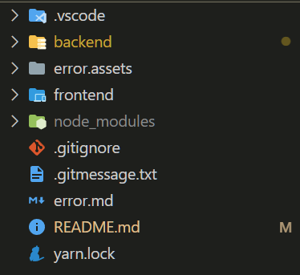
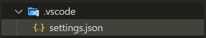

# BOBFULL REFACTORING


## 개요

-   첫 리액트 프로젝트 `밥풀(Bobfull)`의 개선판
-   프로젝트를 진행하며 아쉬웠던 부분을 추가적인 공부를 통해 습득한 지식으로 리팩토링 진행
    -   구현
        -   로그인 과정 (로그인 방식, 개인정보 저장방식)
        -   검색
        -   채팅기능
        -   지도기능
    -   정리
        -   폴더구조
        -   클린코드
        -   타입스크립트 적용
        -   커밋 형식 지키기
        -   개발 이슈 정리하기
        -   ERD 정리

​    

## 개선내용

| 개선내용     | Before                                         | After                            |
| ------------ | ---------------------------------------------- | -------------------------------- |
| 프레임워크   | 프레임워크 없이 React 라이브러리만 사용        | Next.js 사용                     |
| 폴더구조     | 중구난방으로 마구 생성                         | Next.js의 컨벤션에 맞춰 생성     |
| 타입스크립트 | 미적용                                         | 적용                             |
| 회원관리     | JWT토큰 사용                                   | 미정                             |
| 클린코드     | 구현을 목표로 정리없이 작성                    | 다른 사람들이 알아보기 쉽게 작성 |
| SEO          | 미사용                                         | 도입 예정                        |
| 백엔드       | Django Rest Framework 사용 (백엔드분들이 개발) | Nest.js 사용 (본인 개발)         |
| CSS          | 일반 CSS 사용                                  | Emotion 사용                     |
| 상태관리     | redux                                          | recoil + react-query             |

​    

## 작업기록

### 1. 로그인

#### 1-1. 기존 시스템의 미흡한 점

- JWT토큰에 대한 이해가 부족한 채로 사용
- 인증은 잘 구현하였지만 accessToken을 활용한 인가는 localStorage를 활용하여 보안적인 부분을 신경쓰지 못함
- refreshToken을 활용하지 못하여, accessToken의 유효기간을 길게 설정
- 토큰 만료시 프로세스를 구현하지 못하였음
- 개인정보를 `redux`를 통해 상태관리하였음

​    

#### 1-2. 개선점

- JWT토큰은 복호화될 수 있기 때문에 중요한 정보를 담아서는 안됨
- refreshToken을 Cookie방식으로 저장하여 `HttpOnly`와 `Secure` 옵션으로 보안을 신경써서 구현
- accessToken이 만료시 자동으로 refreshToken을 이용해 새로운 accessToken을 받아와 인가되도록 구현
- `recoil`과 `react-query`를 활용하여 로그인 계정 상태관리 구현

   

#### 1-3. 개발일지


#### 개발환경 설정

##### 공통

- `backend`와 `frontend` 폴더로 구성



- `yarn` 패키지 매니저 이용
- `.vscode/setting.json` : `prettier` 설정



```json
// setting.json
{
    "editor.formatOnSave": true,
    "editor.defaultFormatter": "esbenp.prettier-vscode"
}
```

- `.gitignore` 설정

```bash
# .gitignore
node_modules
```

- 커밋 메시지 형식 설정

```bash
# 커밋 메세지 템플릿 적용 명령어
$ git config --local commit.template .gitmessage.txt

# 깃 커밋 메세지를 vscode에서 작성하기 위한 설정
$ git config --local core.editor "code --wait"
```

```bash
# .gitmessage.txt

################
# <타입> : <제목> 의 형식으로 제목을 아래 공백줄에 작성
# 제목은 50자 이내 / 변경사항이 "무엇"인지 명확히 작성 / 끝에 마침표 금지
# 예) feat : 로그인 기능 추가

# 바로 아래 공백은 지우지 마세요 (제목과 본문의 분리를 위함)

################
# 본문(구체적인 내용)을 아랫줄에 작성
# 여러 줄의 메시지를 작성할 땐 "-"로 구분 (한 줄은 72자 이내)


################
# feat : 새로운 기능 추가
# fix : 버그 수정
# docs : 문서 수정
# test : 테스트 코드 추가
# refact : 코드 리팩토링
# style : 코드 의미에 영향을 주지 않는 변경사항
# chore : 빌드 부분 혹은 패키지 매니저 수정사항
################
```


##### FrontEnd

Recoil

```bash
$ yarn add recoil
```


react-hook-form with yup

```bash
$ yarn add @hookform/resolvers yup
```


emotion

```bash
$ yarn add @emotion/react @emotion/styled
```

ant-design

```bash
$ yarn add antd @ant-design/icons 
```


##### BackEnd

- DB 연결 (MySQL)
- 회원가입 API 생성


JWT 모듈

```bash
$ yarn add @nestjs/jwt passport-jwt
$ yarn add --dev @types/passport-jwt
```


passport 모듈

```bash
$ yarn add @nestjs/passport
$ yarn add passport
```

ii환경변수

```bash
$ yarn add dotenv
```

```js
import 'dotenv/config'

process.env.환경변수명
```


nest에서 환경변수 선언

```bash
yarn add @nestjs/config
```


카카오 로그인

```bash
$ yarn add passport-kakao
$ yarn add -D @types/passport-kakao
```

