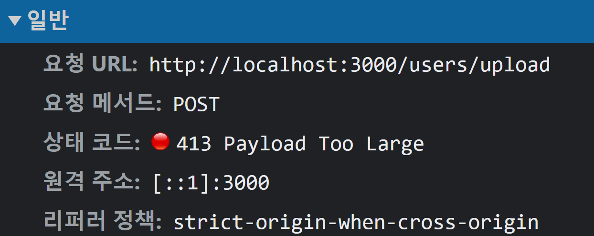
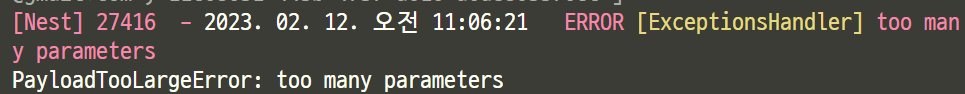
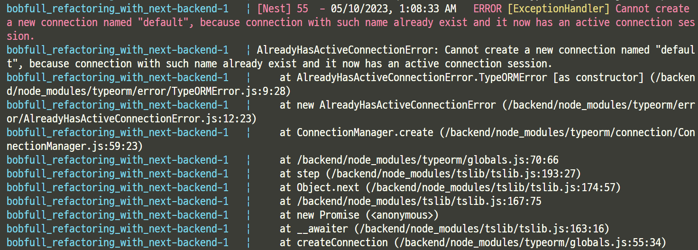

nest.js 설치중 발생한 오류


- 자동으로 마지막에 `;` 넣기 


- 쿠키전송문제

- 1. header에 쿠키를 전송하는데 문제생김

  ```bash
  @Res({ passthrough: true }) res: any,
  ```

  `passthrough` 옵션으로 해결

  Res를 사용하면 nest.js와 express의 사용방식이 달라서 발생하는 문제

  

- 2. 쿠키가 브라우저에 저장이 안됨

`credentials` 옵션을 설정해줘야함

```js
// backend
// main.ts
app.enableCors({
  origin: true,
  credentials: true,
});
```

```js
// frontend
// login.queries.ts 

const result = await axios({
  method: "post",
  url: `${BASE_URL}/auth`,
  data: data,
  withCredentials: true,
});
```


- **SyntaxError****:** **Cannot use import statement outside a module**
  - 정의되지 않은 함수를 import 하려고 하였음

  

  

  

-  TypeError: (0 , multer_s3_1.default) is not a function

```bash
(x) import multerS3 from 'multer-s3';  
(o) import * as multerS3 from 'multer-s3';
```


- 내장모듈인 `path` 가 안읽어지는 이유

```typescript
(x) import path from 'path';
(o) import * as path from 'path';
```


- PayloadTooLargeError: request entity too large






-**Error****:** **Text** **content** **does** **not** **match** **server-rendered** **HTML.**

**Error****:** **Hydration** **failed** **because** **the** **initial** **UI** **does** **not** **match** **what** **was** **rendered** **on** **the** **server.**

**Error****:** **There was an error while hydrating. Because the error happened outside of a Suspense boundary, the entire root will switch to client rendering.**

recoilstate를 사용하여 삼항연산자를 사용해서 그런듯?

서버사이드렌더링시 recoilstate의 조건을 읽지 못해서 나타나는 현상

- useState와 useEffect를 사용하여 렌더링시 useState값에 세팅되도록 설정

```typescript
	const isLogin = useRecoilValue(isLoginState);
  const [isLogined, setIsLogined] = useState(false);
  const handleChange = (event: React.SyntheticEvent, newValue: string) => {
    setValue(newValue);
  };

  useEffect(() => {
    setIsLogined(isLogin);  
  });

  return (
			...
      {isLogined ? (
        <BottomNavigationAction
          component={NextLinkComposed}
          to={{ pathname: "/profile" }}
          label="Profile"
          value="Profile"
          icon={<RestoreIcon />}
        />
      ) : (
        <BottomNavigationAction
          component={NextLinkComposed}
          to={{ pathname: "/login" }}
          label="Login"
          value="Login"
          icon={<RestoreIcon />}
        />
      )}
```


docker nestjs 핫리로드 설정중에 발생한 오류

서버시작 후 핫로딩이 발생하면 db와 연결이 끊기면서 서버가 다운된다.



1. TypeOrmModule.forRoot()를 TypeOrmModule.forRootAsync({ useFactory: async () => ({}) }) 로 변경
2. 기존 연결 해제 후 재연결

```typescript
// app.module.ts
export class AppModule {
  constructor(private connection: Connection) {
    this.restaurantService.insertData();
  }

  async onModuleDestroy() {
    await this.connection.close();
  }
}
```

