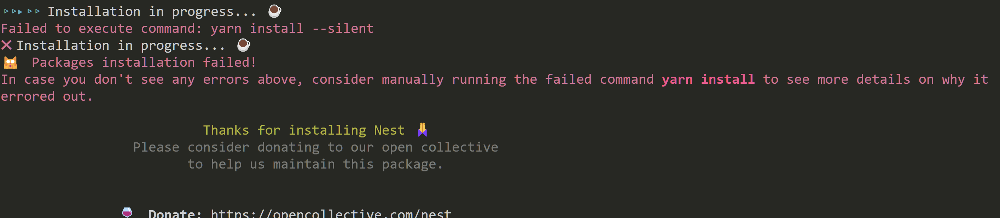
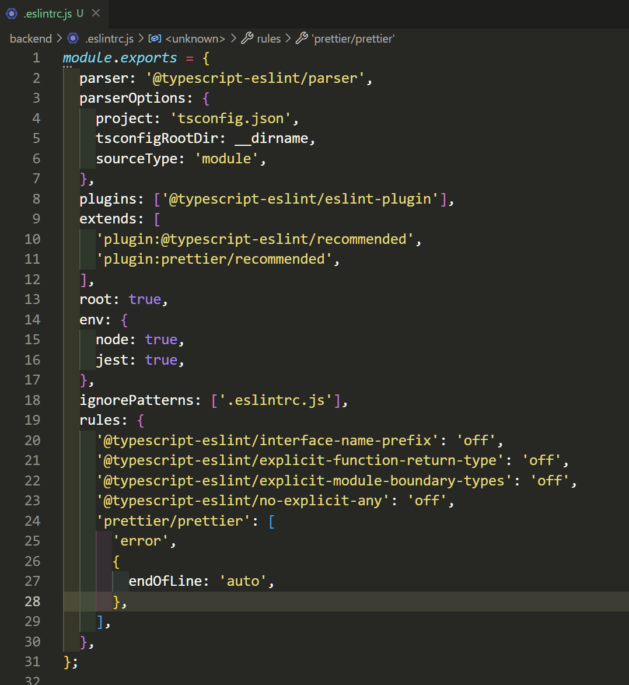

nest.js 설치중 발생한 오류




- 자동으로 마지막에 `;` 넣기 




- 쿠키전송문제

- 1. header에 쿠키를 전송하는데 문제생김

  ```bash
  @Res({ passthrough: true }) res: any,
  ```

  `passthrough` 옵션으로 해결

  Res를 사용하면 nest.js와 express의 사용방식이 달라서 발생하는 문제

  

- 2. 쿠키가 브라우저에 저장이 안됨

`credentials` 옵션을 설정해줘야함

```js
// backend
// main.ts
app.enableCors({
  origin: true,
  credentials: true,
});
```

```js
// frontend
// login.queries.ts 

const result = await axios({
  method: "post",
  url: `${BASE_URL}/auth`,
  data: data,
  withCredentials: true,
});
```